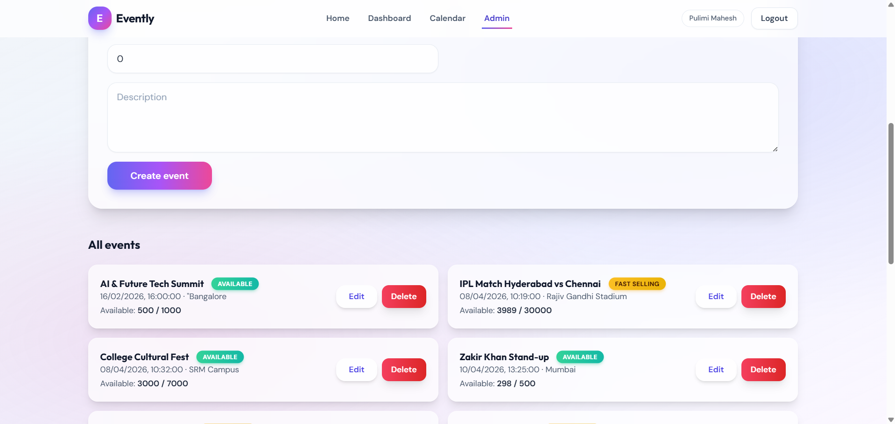

## 🎥 Demo Video

[Watch Demo Video (Google Drive)](https://drive.google.com/file/d/1-wM_3gl84zSI-fh_bizgx2k8WgOhdmC1/view?usp=sharing)

🌐 Deployed Link: [Evently Live App](https://evently-weld-five.vercel.app)

> **Reviewer Demo Credentials (for project evaluation only)**
>
> **Admin Account**
> - Email: `pulimimahesh7@gmail.com`
> - Password: `Mahia@2025`
>
> **Sample User Account**
> - Email: `sunnymahesh719@gmail.com`
> - Password: `Mahia@2025`

---

# 🚀 Evently — MERN Event Booking System

Live Application: _TBD_
Demo Video: [Google Drive Demo](https://drive.google.com/file/d/1-wM_3gl84zSI-fh_bizgx2k8WgOhdmC1/view?usp=sharing)

---

# 📌 Overview

**Evently** is a production-ready MERN event booking platform that delivers an Eventbrite/BookMyShow-style experience: smart event discovery, real-time ticket availability protection, calendar navigation, Stripe checkout, and strict role-based access control.

It’s built to be **scalable**, **secure**, and **pleasant to use**, with a premium Tailwind UI, smooth animations, and a clean backend architecture.

---

# 🎯 Problem Statement

Event booking systems often suffer from:

- **Manual & error-prone booking flows** that cause overselling
- **Poor event discovery** (no sorting, filters, or calendar navigation)
- **Weak access control** leading to unauthorized admin actions

Evently provides a robust, modern solution with atomic ticket reservation logic, role-locked admin tools, and a polished frontend UX.

---

# ✨ Key Features

## 🔐 Authentication

- JWT-based login/signup
- Local token storage (client) + Authorization header injection
- Role-based access control (**admin** / **user**)

## 📊 Core Features

- **Event browsing**: upcoming vs past sorting
- **Search & filters**: category/date/price range + free text
- **Event details**: pricing, availability, status labels
- **Booking system**: ticket quantity, availability validation
- **Booking history**: upcoming vs past, computed status, payment status

## ⚡ Advanced Features

- **Atomic availability protection** to prevent overbooking
- **Event status** labeling: SOLD_OUT / FAST_SELLING / AVAILABLE
- **Calendar navigation** with highlighted event dates
- **Notifications**: booking confirmations + in-app reminders (scheduler)

## 🎨 UI/UX

- Premium Tailwind UI (glassmorphism, gradients, soft shadows)
- Mobile-first responsive layout
- Smooth animations (Framer Motion)
- Loading skeletons + empty states

---

# 📅 Dashboard (User Insights)

Dashboard provides:

- Notifications feed (booking updates + reminders)
- **Upcoming bookings** vs **past bookings**
- Full booking details: title, date, location, tickets, total, booking ID
- Computed booking status:
  - **Pending** (payment not completed)
  - **Confirmed** (paid + upcoming)
  - **Completed** (event date passed)
- Cancel booking action (only when eligible)

---

# 🔔 Notifications System

In-app notifications support:

- Booking created confirmations
- Booking cancelled updates
- Reminder notifications for upcoming events (scheduler)

---

# 🧠 System Logic

## Event Sorting

API returns:

- **Upcoming** events: `date >= now` sorted ascending
- **Past** events: `date < now` sorted descending

Response shape:

```json
{
  "upcoming": [],
  "past": []
}
```

## Booking Logic (Overbooking Protection)

Booking creation uses an **atomic update** to reserve inventory:

- Only decrements tickets when `availableTickets >= requested`
- Prevents double booking / overselling under concurrency

## Booking Status Rules (Dashboard)

- If event date passed → **Completed**
- Else if payment not done → **Pending**
- Else → **Confirmed**

## Calendar Integration

- Calendar highlights dates with events
- Click a day to filter events: `GET /api/events?date=YYYY-MM-DD`

---

# 🔄 API Endpoints (Main)

## Auth

- `POST /api/auth/register`
- `POST /api/auth/login`

## Events

- `GET /api/events`
- `GET /api/events?date=YYYY-MM-DD`
- `GET /api/events/:id`
- Admin-only:
  - `POST /api/events`
  - `PUT /api/events/:id`
  - `DELETE /api/events/:id`

## Bookings

- `POST /api/bookings` (user-only)
- `GET /api/bookings/user` (user/admin read access)
- `POST /api/bookings/:id/cancel` (eligible upcoming bookings only)

## Payments (Stripe)

- `POST /api/payments/create-checkout-session` (user-only)
- `POST /api/payments/webhook` (optional; needs webhook secret)

## Admin

- `GET /api/admin/stats`
- `GET /api/admin/events`
- `GET /api/users`
- `PATCH /api/users/:id/block`

---

# ⚙️ Technology Stack

## Frontend

- React + Vite
- Tailwind CSS
- Axios
- Framer Motion
- react-calendar

## Backend

- Node.js
- Express
- Mongoose (MongoDB)
- express-validator
- Helmet + HPP + CORS + Morgan

## Database

- MongoDB (Atlas compatible)

## Integrations

- Stripe Checkout
- JWT Auth

---

# 📂 Project Structure

```text
smart/
  client/
    src/
      components/
      context/
      lib/
      pages/
  server/
    src/
      controllers/
      middleware/
      models/
      routes/
      services/
      utils/
```

---

# 🚀 Quick Start (Local)

## 1) Clone & install

```bash
# Frontend
cd client
npm install

# Backend
cd ../server
npm install
```

## 2) Configure environment variables

Create:

- `server/.env` (copy from `server/.env.example`)
- `client/.env` (copy from `client/.env.example`)

## 3) Run development servers

Backend:

```bash
cd server
npm run dev
```

Frontend:

```bash
cd client
npm run dev
```

---

# 🔑 Environment Variables

Backend (`server/.env`):

```env
PORT=5005
MONGODB_URI=your_mongodb_uri
JWT_SECRET=your_secret
JWT_EXPIRES_IN=7d
STRIPE_SECRET_KEY=your_key
STRIPE_WEBHOOK_SECRET=your_secret
CLIENT_URL=http://localhost:5173
```

Frontend (`client/.env`):

```env
VITE_API_URL=http://localhost:5005/api
```

---

# 🔐 Security Notes

- **Never commit `.env`** files (this repo ignores them).
- Rotate credentials if they were ever shared publicly.
- Use production-grade secrets management for deployment (e.g., Vercel/Render environment variables).

---

# 🚀 Future Improvements

- Websocket/polling-based live availability updates
- Email notifications (SendGrid/SES) in addition to in-app reminders
- Refund flow + paid booking cancellation policy
- Admin analytics charts (time-series revenue, category performance)
- Automated API tests + CI workflow

---

# 📄 License

MIT (or update as needed).

---

# 🖼️ Application Screenshots (Flow Order)

## 1) Signup


## 2) Login


## 3) Home Page


## 4) Calendar


## 5) Admin Pages





## 6) Dashboard Pages


## 7) Booking


## 8) Payment


